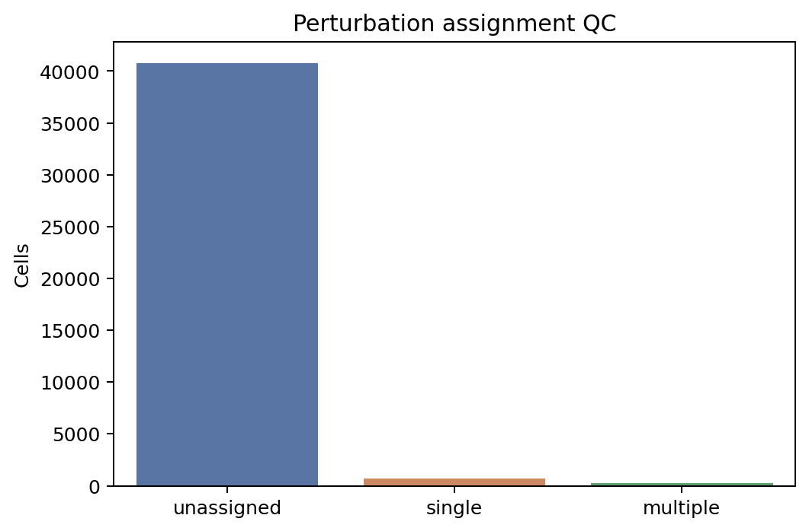

# GSE274058 Reference Results

这页发布的是 `shen_2026_scrnaseq` (`GSE274058`) 的 dissociated reference-side 结果包。它服务于 reference signature、program reconstruction 和后续 cross-platform concordance；它不是 spatial benchmark 的主图页面。

## Provenance

```{include} results/gse274058_reference/overview.md
```

## GitHub Release Assets

- [Full result bundle](https://github.com/hutaobo/SpatialPerturb/releases/latest/download/gse274058_reference_run_bundle.tar.gz)
- [Compressed intrinsic DE table](https://github.com/hutaobo/SpatialPerturb/releases/latest/download/gse274058_reference_run_intrinsic_de.tsv.gz)
- [SHA256SUMS](https://github.com/hutaobo/SpatialPerturb/releases/latest/download/SHA256SUMS.txt)

## A100 Confirmation

```{include} results/gse274058_reference/a100_status.md
```

当前 public summary 已按 A100 重跑结果更新；若后续 A100 rerun 与本页不同，release assets 会继续以最新权威 rerun 为准重新生成。

## Dataset Scale and Barcode QC

```{include} results/gse274058_reference/qc_summary.md
```



## Valid Perturbations

下表把 inference QC 通过的 perturbations 与一个简化版 `knockdown_adequate` 标记放在一起，便于在论文叙事里区分“能算”与“值得主张”的层级。

```{include} results/gse274058_reference/valid_perturbations.md
```

## Focus Perturbations

当前结果优先展示 `Lrrk2` 和 `Srf`，因为它们都是真实跑出来的 valid perturbations，同时也最能说明 reference-side signatures 与 target knockdown 质量之间并不总是等价。

```{include} results/gse274058_reference/top_hits.md
```

### Target-Gene Sanity Check

```{include} results/gse274058_reference/target_gene_sanity.md
```

## Program Summary

`program_matrix.tsv` 已覆盖全部成功跑完 pseudobulk intrinsic DE 的 perturbations。这里展示每个 perturbation 对应的 program gene count，方便检查后续 cross-platform 对齐时的覆盖范围。

```{include} results/gse274058_reference/program_summary.md
```

## How To Improve

```{include} results/gse274058_reference/improvement.md
```
